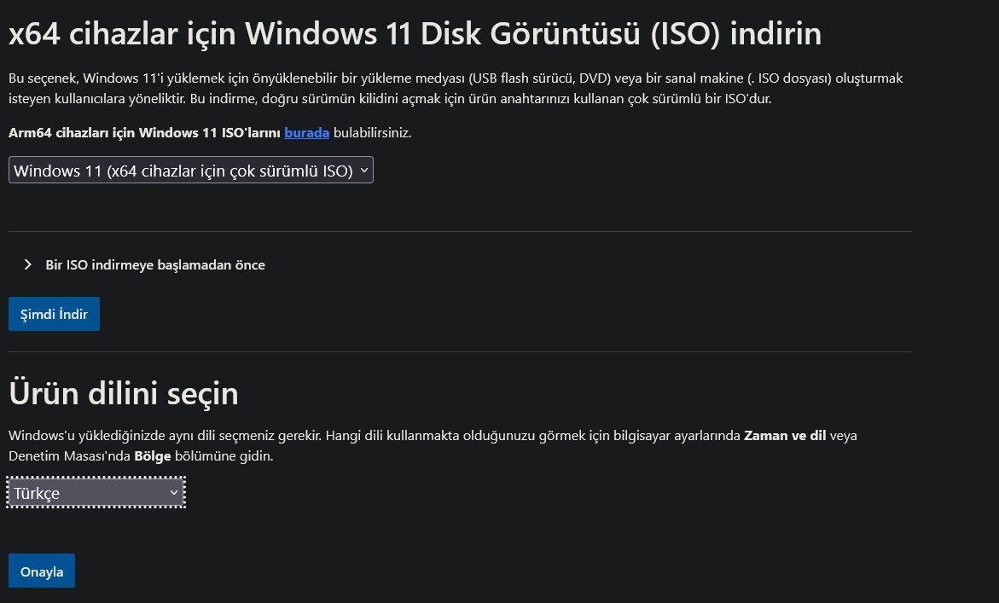
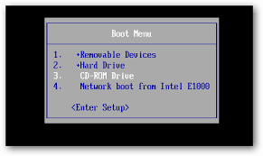

# Windows 11 Nasıl Kurulur

### Gerekli Bileşenler

* En Az 8GBlık Bir Flash Bellek
* Windows 11 İso Dosyası
* Bilgisayar

### Adım 1: Windows 11 İmajını İndirme

[Microsoftun resmi sitesinden](https://www.microsoft.com/tr-tr/software-download/windows11) windows 11 isosunu indirelim.

<figure><figcaption></figcaption></figure>

### Adım 2: Rufus Kurulumu

[Rufus programını resmi sitesinden](https://rufus.ie/en/) indirelim.

<figure><figcaption></figcaption></figure>

Buradan tavsiyemiz rufus-4.6p.exe sürümünü indirmeniz olucaktır.

### Adım 3 : Flash Belleğe İmaj Yazma

Bu adımda bilgisayarınıza usb belleğinizi Takmalısınız.Sonrasında Rufus Programını Çalıştırın.

<figure><figcaption></figcaption></figure>

Önünüzüze Çıkan Bu Ekrandan Aygıt Bölümünden Flash Belleğinizi Seçin.Önyükleme Şeçimi Bölümünde İse İndirdiğiniz Windows 11 İmajını Seçin.

<figure><figcaption></figcaption></figure>

Bu Bölümde Sisteminizin Uefi Olup Olmamasının Büyük Önemi Var.Sisteminiz Uefi Destekliyor İse Gptyi Desteklemiyor İse Mbryi Seçmelisiniz.Sisteminizin Uefi Destekleyip Desteklemediğini Öğrenmek İçin İnternette Anakartınıx Modelini Yazıp Araştırma Yapabilirsiniz.Genelde 2010 Sonrası Anakartlar Uefi Destekliyor Ancak Şüpheliyseniz MBR Seçebilirsiniz.Mbr 2 Türlüde Uyucaktır Ancak Yeni Sistemlerde Tam Performans Alamassınız Kısaca\
**Uefi Destekliyorsa - GPT**\
**Uefi Desteklemiyorsa - MBR**\
.png>)\
Hazır Yazısı Ortaya Çıktıysa Başlat Diyebilirsiniz\

<figure><figcaption></figcaption></figure>

Burada Tüm Seçenekleri Aktifleştirmenizi Öneriyorum.Kurulumu Oldukça Hızlandıracaktır.

### Adım 4: Flash Belleği Boot Etmek

Flash Belleği Boot Etmek İçin Bilgisayar Kapatıp Açılmadan İlk Yazı Geldiği An Boot Tuşuna Basmalıyız.Boot Tuşu Her Anakartta Değişmektedir.Anakart Modelinizi İnternete Yazarak Boot Tuşunuzu Öğrenebilirsiniz.Bazı Bilindik Anakartların Bios Tuşları.

| Marka (Anakart,Laptop) | BIOS Giriş Tuşu | Boot Menüsü Tuşu     |
| ---------------------- | --------------- | -------------------- |
| Acer                   | F2              | F12                  |
| ASUS                   | F2 yada Delete  | Esc yada F8          |
| Casper                 | F2              | F12                  |
| Chiligreen             | F2              |                      |
| Dell                   | F2              | F12                  |
| ECS                    | F2              | F7                   |
| Exper                  | F1 yada F2      | Esc yada F2          |
| Fujitsu                | F2              | F12                  |
| Gigabyte               |                 | F12                  |
| Grundig                | F2              | F11                  |
| HP                     | F10             | F9, F10 yada Esc     |
| Lenovo G560            | F2              | F12 yada Nova Tuşu   |
| LG                     |                 | F10                  |
| MSI                    | F2 yada Delete  | F11                  |
| Monster                | F2              | F7                   |
| Pegatron               |                 | F11                  |
| Packardbell            | F2              |                      |
| Samsung                | F2              | F9, F10 yada Esc     |
| Sony Vaio              | F2              | F11 yada Assist tuşu |
| Toshiba                | F2              | F12                  |

Bu Tuşların Hiçbiri Olmadıysa İnternetten Araştırma Yapmanız Gerekmektedir.Boot Menüleri Anakarttan Anakarta Değişmektedir.Ancak Yapacağınız İşlem Aynı Flash Belleğinizi Seçmelisiniz

<figure><figcaption>
Örnek Görüntü
</figcaption></figure>

Buradan Flash Belleğimizi Seçtikten Sonra Windows 11 Kurulum Ekranı Bizi Karşılayacaktır.

### Adım 5:Windows Kurulumu

<figure><figcaption></figcaption></figure>

Bu Ekranda Türkçe Dilini Seçeceğiz.Devamında;

<figure><figcaption></figcaption></figure>

Tüm Dosyalarımızın Silineceğini Kabul Etmeliyiz Ve İleri Diyeceğiz.

<figure><figcaption></figcaption></figure>

Burdaki Ekranda Ürün Anahtarım Yok Diyeceğiz.Kurulum Sonrası İsterseniz İnternette Araştırma Yaparak 20-30 tlye OEM Keyler Alarak Windowsunuzu Etkinleştirebilirsiniz.

<figure><figcaption></figcaption></figure>

Bu Ekranda Windows 11 Homemi Yoksa Promu Kurmak İstedğimizi Soruyor.Genel Oyun İnternet Araştırmaları İçin Home Sürümü Yeterli Olucaktır.

<figure><figcaption>
Örnek Görüntü
</figcaption></figure>

Geldik En Kritik Noktaya.Bu Noktada Oldukça Dikkatli Olmamız Gerekiyor.Sisteminizde Birden Fazla Disk Bulunuyor İse Bunlar Disk 0,1 Olarak Adlandırılacaktır.Burada Özellikle D Diskinize Yedek Aldıysanız D Diskinizin GB Sini Bilmeniz Gerekmekte Çünkü Yanlışlıkla D Diskinizi Formatlayabilrisiniz.\
Yapmanız Gereken Windowsu Kuracağız C Diskinin Bütün Bölümlerini Silmek.Bu Örnek Görüntüde 1 Adet Disk Olmasına Rağmen Windows 11 Flash Belleğimizide Bir Disk Olarak Görmektedir.Bu Sebepten Dolayı Flash Belleğinizi Bu Ekrandan Tespit Edip Onu Formatlamanız Gerekmekte.Örnek Görüntüde Windows Disk 0 a kurulacak.Sizde Kendiniz Hangi Diske Kuracaksanız O Diske Aynı İşlemleri Uygulamalısınız.

<figure><figcaption>
örnek görüntü
</figcaption></figure>

Tüm Bölümlerin Üzerlerine Teker Teker Basarak Siliyoruz

<figure><figcaption>
örnek görüntü
</figcaption></figure>

Diskimiz Artık Tek Parça Halinde Ve Ayrılmamış Alan Şeklinde Bulunmakta

<figure><figcaption></figcaption></figure>

Diskimizi Seçerek Bölüm Oluşturma Diyoruz Ve&#x20;

<figure><figcaption></figcaption></figure>

Diski Bölme İşlemi Bu Noktada Karışık Olucağı İçin Direkt Olarak Uygula Diyoruz.(İsterseniz Bölebilirsiniz Ancak Karışık Olmasın Diye Göstermedim).

Oluşan Disk Bölümünü Seçerek İleri Diyelim.

<figure><figcaption></figcaption></figure>

Yükle Diyoruz Ve Gelen Ekrandaki Sayacın %100 Olmasını Bekliyeceğiz.

<figure><figcaption></figcaption></figure>

Bu Bölümde Bir Ağa Bağlanmanız Şart.Ethernet İle İnternet Varsa Muhtemelen Sıkıntı Çıkmaz Ancak Bir Laptop Kullanıyorsanız Veya Wifi Kullanıyorsanız Ve Wifi Ağları Çıkmıyorsa Cihazınızın Sitesinden İndirdiğiniz Wifi Sürücüsü Bu Bölümde Sürücü Yükle Diyerek Kuruyoruz.

<figure><figcaption>
Örnek Görüntü
</figcaption></figure>

Direk Olarak Masaüstüne Aktarılıyoruz Ve Kurulum Tamamlanmış Oluyor.Sonraki Konularımızızda Kurulum Sonrası Yapılması Gerekenlerden Bahsedeceğiz.
